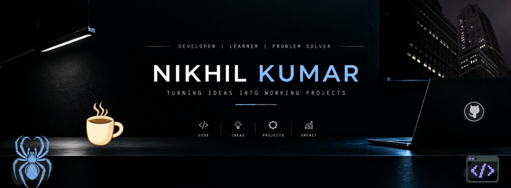

<i>

  

  

<table align="center">
<tr>
<td align="center" width="400">

</td>
</tr>
</table>

<table align="center">
<tr>
<td align="center" width="400">

</td>
</tr>
</table>

<h2 align="center">
  ⟡ 𝐀𝐁𝐎𝐔𝐓 𝐌𝐄 ⟡
</h2>

Name: Nikhil kumar 
location:  India (Bihar) 
Pursuing: B.Tech CSE (AI & ML)

##  ⟡ I'M EXPLORING ⟡

## ⟡ Currently Working on ⟡

  ***Voice Assistant*** — <i>Exploring Python, automation & voice interaction  </i> 
**Repository** — [Voice-assistant](https://github.com/Nikhilvishwa18/Voice-assistant) 
  ***DSA Practice*** — <i>Strengthening problem-solving with C </i> 
  ***Web Projects*** — <i>Learning by building things from scratch</i>

##  ⟡ Connect With Me ⟡

---

`BUILD` → `BREAK` → `DEBUG` → `LEARN` → `LEVEL UP`

<h3><i>Thanks for exploring my corner of the internet.</i> </h3>

 </i>

<code>01001000 01000101 01001100 01001100 01001111</code>

---

